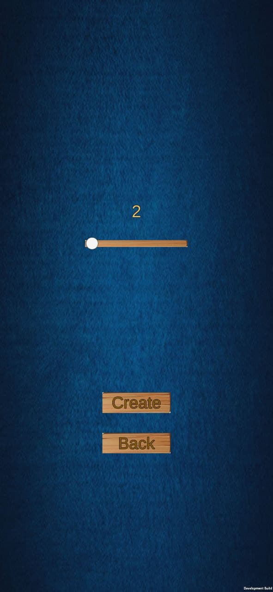

# card game

basic card comparison game with multiplayer functionality

main menu -

create room options -

room created -

another player joins the room -

game starts and trait menu shows up -

what is chosen - 

who won that round -

and the game goes on till the cards are over.
